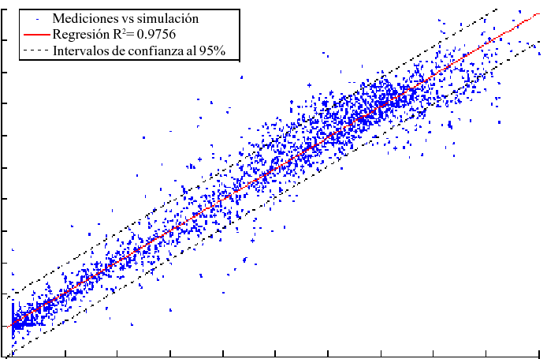

**ANN**
**1. Preparación de Datos**
Recolección y Limpieza: Asegúrate de que tus datos estén limpios y libres de errores. Esto incluye manejar valores faltantes, eliminar duplicados y corregir datos erróneos.
Preprocesamiento: Escala o normaliza los datos para que estén en un rango adecuado. Técnicas comunes incluyen la normalización min-max o la estandarización (transformar a una media de 0 y una desviación estándar de 1).
**2. División de Datos**
Conjunto de Entrenamiento y Prueba: Divide tu conjunto de datos en al menos dos partes: uno para entrenar el modelo y otro para evaluar su rendimiento. Una división común es 80% entrenamiento y 20% prueba.
Validación Cruzada: Para una evaluación más robusta, puedes usar validación cruzada k-fold, donde el conjunto de datos se divide en k partes, y cada una se usa tanto para entrenar como para evaluar el modelo en diferentes iteraciones.

