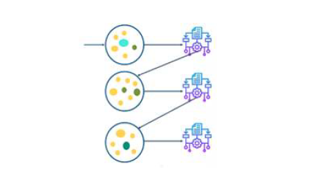

# Algoritmo de boosting

Por otro lado, dentro de los algoritmos ensamblados tenemos los algoritmos de boosting. Algunos ejemplos de estos algoritmos son el XGBoost o el AdaBoost.

En los algoritmos de boosting, los modelos simples son utilizados secuencialmente, es decir, cada modelo simple va delante o detrás de otro modelo simple. 

El principal objetivo de los métodos secuenciales es el de aprovecharse de la dependencia entre los modelos simples. El rendimiento general puede ser mejorado
haciendo que un modelo simple posterior les dé más importancia a los errores cometidos por un modelo simple previo. 

Poniendo un ejemplo, es como si al intentar resolver un problema se aprovechase el conocimiento de los errores de otros.

  
  
Figura 5. Esquema del concepto de boosting.

