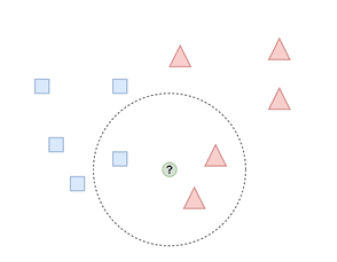

# K-vecinos más cercanos (KNN)

El algoritmo de k-vecinos más cercanos (K-nearest neighbors), generalmente conocido como KNN, es un modelo usado tanto para problemas de regresión como
para problemas de clasificación.

El principio de los modelos de KNN es el de encontrar las k muestras de entrenamiento más cercanas en distancia a la muestra de la que se pretende predecir la
variable dependiente. A partir de las variables dependientes de esos “k vecinos”, se estima la variable dependiente de la muestra en cuestión.

Es decir, el objetivo primero es obtener los k vecinos de la muestra n de la que solo se dispone de las variables independientes Xn=(X1, X2, …, Xp). Con esos k
vecinos se puede predecir Y a partir de las Y1, Y2, …, Yk de sus k vecinos.

  
  
<em><strong>Figura 2.</strong> KNN con K=3</em> 

