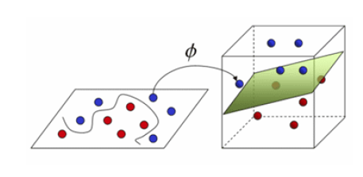

# Máquinas de soporte vectorial

Son conocidas sobre todo para problemas de clasificación. Sin embargo, los fundamentos también se pueden utilizar para problemas de regresión. En este caso, los modelos se denominan SVR (del inglés support vector regression).

El punto clave de las máquinas de soporte vectorial es el concepto de cambiar de un espacio original a uno de mayor dimensión, donde el problema es más sencillo de resolver. Esto se conoce como el kernel trick, ya que se utiliza una función Kernel que hace esa transformación. En la figura 22 se
muestra un ejemplo de cambio de dimensión de un espacio de dos dimensiones a uno de tres.

  
  
<em><strong>Figura 6.</strong> Concepto de kernel trick en SVM.</em>

