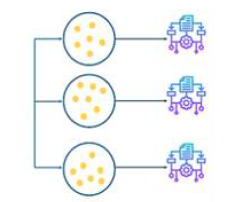

# Random forest

Hasta ahora los modelos que se han presentado son modelos simples, es decir, no están formados por combinaciones de varios modelos. La combinación de
modelos simples es un método muy utilizado en aprendizaje automático. En competiciones online como Kaggle son los que han demostrado ofrecer mejores
resultados. Entre los métodos más utilizados se encuentran el XGBoost o el Random forest. Los algoritmos formados por combinaciones de algoritmos simples
reciben el nombre de algoritmos ensamblados.

Aunque hay diversas formas de ensamblar o unir algoritmos débiles para formar otros, las más usadas y populares son el bagging y el boosting (aunque existen
otras más avanzadas como el stacking). Cada tipo de algoritmo tiene unas ventajas y unos inconvenientes y pueden ser usados convenientemente según la
problemática.
## Métodos de bagging

Son sistemas donde varios algoritmos simples son usados en paralelo. El principal objetivo de los métodos en paralelo es el de aprovecharse de la
independencia que hay entre los algoritmos simples, ya que el error se puede reducir bastante al promediar las salidas de los modelos simples. Es
como si, queriendo resolver un problema entre varias personas independientes unas de otras, se diese por bueno lo que eligiese la mayoría de las
personas.

  
  
<em><strong>Figura 1.</strong> Esquema del concepto de bagging.</em>

