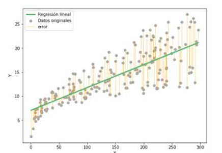

# <u> Regresión lineal</u>

Se trata de uno de los algoritmos más sencillos de aprendizaje supervisado. Este procedimiento se documentó por primera vez al publicarse el método
de mínimos cuadrados por Legendre en el año 1805

## Problemas de regresión

1. ¿Cuál es el precio de mercado de una casa en función de su tamaño, número de habitaciones o número de baños?

2. ¿Cuántas ventas va a tener una empresa de retail en función de la inversión, el tamaño de la plantilla y el número de tiendas?

3. ¿Cuál es la tasa de empleo esperada en un país en función de la oferta monetaria del banco central, la oferta de trabajo y la demanda de
profesionales?

Gauss de la propagación de errores, de 1821, 1823 y 1826. Aunque es uno de los métodos más simples que hay si se compara con otros algoritmos
más modernos, continúa siendo ampliamente usado.

  
  
<em><strong>Figura 1.</strong> Representación de una regresión lineal y sus errores.</em>

