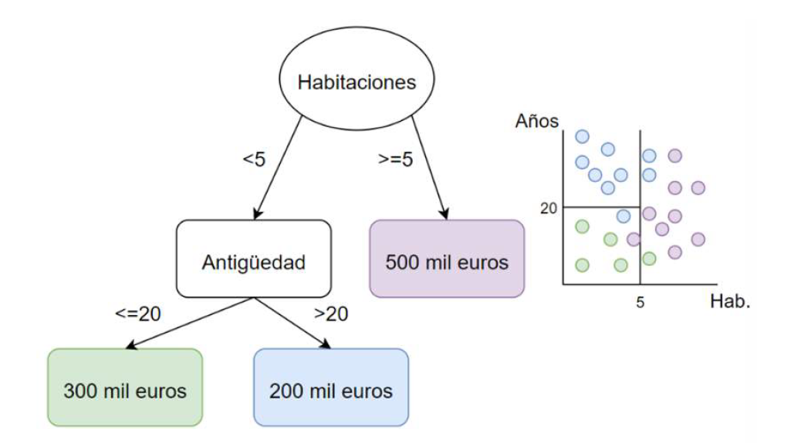

# Árbol de decisión

Es un modelo de aprendizaje jerárquico que divide el espacio utilizando reglas de decisión. Es válido tanto para modelos de regresión como para
modelos de clasificación.
Su objetivo es el de crear un modelo que prediga el valor de una variable dependiente aprendiendo reglas de decisión simples a partir de las variables
independientes.

Los árboles de decisión están formados por nodos y hojas. Los nodos son aquellos puntos donde se toma una regla de decisión. Las hojas son las decisiones
finales del árbol. En el caso de los árboles aplicados a regresión, el criterio estándar para decidir los cortes es el error cuadrático medio.
En la figura 9 se muestra un esquema de árbol de decisión de dos variables para la predicción del valor de casas (Y = precio) a partir de las variables X =
(habitaciones, antigüedad). El árbol realiza cortes en el valor de las variables independientes X, escogiendo el punto de corte óptimo. Las cajas de colores son lo
que se denomina hojas, con fondo blanco se muestran los nodos, en este caso, habitaciones y antigüedad.

  
  
Figura 3. Ejemplo de separación de datos de un árbol de decisión regresión.

